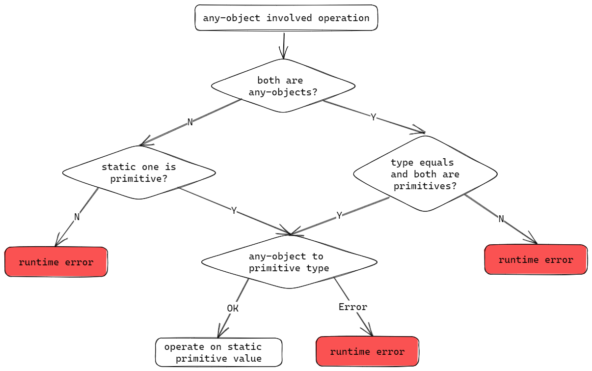

# Any-objects

If the type of a variable is not decided, you can use `any` as the type annotation, and this variable will be treated as a pure JavaScript object.

``` TypeScript
let obj: any = { x: 1 };
```

You can later assign other types to this variable, or add new fields to it.

``` TypeScript
obj = 1;
obj = "string";
obj = true;
obj = { x: 1, y: 2 };
obj.z = 3;
```

> Note: any-objects works with low performance, it is always recommended to use statically typed variables whenever possible.

## boundary between static and dynamic world

Since any-objects are managed by external environment, there is a boundary between static and dynamic world. Assigning a static variable to an `any-object` requires a boxing operation, while the reverse operation necessitates an unboxing process.

### box to any

``` TypeScript
let static_number = 123;
let static_object = { x: 1 };

let any_number: any = static_number; // box by value
let any_object: any = static_object; // box by ref
```

box to any follow these rules:
1. primitive types (`number`, `boolean`, `string`) are boxed by value, the value of these variables are copied to external world, and further modification on these boxed any-objects will not affect the original value.
2. other types are boxed by reference. The external world will hold a reference to the original object, and modification on these boxed any-objects will be visible to the static world if the operated field exists in static world.

``` TypeScript
    let static_object = { x: 1 };
    let any_object: any = static_object; // box by ref
    any_object.x = 2; // modify property

    console.log(static_object.x); // 2
    console.log(any_object.x);    // 2
```

### mixed type

if new properties are added to these boxed any-objects, the newly added properties are managed by the external world, and not visible to the static world, these any-objects are called `mixed type` because they have both static and dynamic part.

``` TypeScript
    let static_object = { x: 1 };
    let any_object: any = static_object; // box by ref
    any_object.y = 2; // add new property

    console.log(static_object.y); // compile error
    console.log(any_object.y);    // 2
```

### unbox from any

bring any-objects back to static world is called unboxing, in TypeScript this kind of operation will cause type unsoundness because the compiler will not apply type checking for any-objects involved assignment.

In ts2wasm-compiler, additional instructions will be generated to do runtime type checking for these operations, and throw runtime error if the type is not matched.

``` TypeScript
class A {
    x: number = 1;
}

class B {
    x: number = 1;
    y = 1;
}

let any_number: any = 123;
let any_string : any = 'Hello';
let any_object: any = { x: 1 };
let any_object2: any = new A();

let static_number: number = any_number; // OK
static_number = any_string;             // runtime error
let static_object: A = any_object;      // runtime error
static_object = any_object2;            // OK
let static_object2: B = any_object2;    // runtime error
```

unbox any follow these rules:
1. primitive types (`number`, `boolean`, `string`) can be unboxed as long as their actual types are matched with the static ones.
2. other types can only be unboxed if they are previously boxed from the same static type, it is not possible to unbox a dynamic object to static world.

## Any-objects involved operations

ts2wasm-compiler doesn't define operation between any-objects, when any-objects are involved in operations, the compiler will auto unbox them to static primitive values, and then perform the operation in static world.



``` TypeScript
let any_number: any = 123;
let any_string : any = 'Hello';
let any_object: any = { x: 1 };
let any_object2: any = new A();

let static_number: number = any_number + 1;         // OK, any_number is unboxed to number
static_number = any_number + any_number;            // OK, any_number is unboxed to number
static_number = any_string + 1;                     // runtime error, unbox any_string to number failed
let static_object: A = any_object + any_object2;    // runtime error, any_object and any_object2 are not primitive types
```
