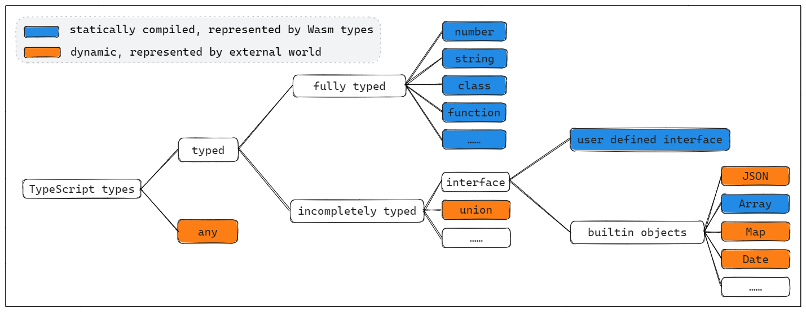

# Basic concepts

## Types in TypeScript

In TypeScript, every variable is associated with a type annotation, these annotations can be divided into two categories:

1. `typed`

    This kind of annotation contains the type information for the corresponding variables, it can be subdivided into the following categories:

    1. `fully typed`

        Provide sufficient type information for static compilation, the memory layout can be decided by the compiler. E.g. `number`, `string` and `class` are treated as this category.

    2. `incompletely typed`

        Provide limited information about the type, but these information is not enough for defining the memory layout at compile time. E.g. `interface` defines least required fields of the type, but the field layout is not defined; `union` defines the possible types of a variable, but we can't know what it will be during compilation.

2. `any`

    `any` is a pure JavaScript dynamic object, compiler have no information about `any-objects` (any-typed objects)

As shown in the graph above, the fundamental processing principles for different type categories in ts2wasm-compiler following these rules:
- `fully typed`: statically compiled and represented as Wasm value types or WasmGC types
- `any`: represented as `externref`, and any operation on the `any-objects` will be compiled as invoking pre-defined APIs, which means the dynamic objects are managed by external environment.
- `incompletely typed`: each specific type requires individual analysis based on the particular circumstances, e.g.:
    - `union` is actually a dynamic type because the type can change during runtime, so it's treated as `any`
    - `user defined interface` is widely used in TypeScript, treating it as dynamic will largely influence the performance, so we introduced `meta` to apply static compilation
    - `builtin objects` are objects provided by JavaScript runtime, TypeScript defines them as interface for type checking purpose.

        - Implementing these built-in objects demands a significant amount of effort, so we treat them as `any` by default, this allows us to immediately use the standard library implementation already available in external environment. (see [fallback](../fallback.md))

        - Simultaneously, we are working on static compilation solutions for selected built-in objects (e.g. `String`, `Array`) to improve performance. The priority of static compilation for these objects is determined based on their actual usage frequency.

## Type system overview

Ts2wasm compiler treats TypeScript as a mixed typed language, there are static types such as `Class`, `Primitives`, as well as dynamic types such as `any` and `union`, the developers should be aware that different types will have different performance impact, it is always recommended to reduce the usage of dynamic types.

|  ts type | category | wasm type | access strategy | performance overhead |
| :----: | :----: | :----: | :----: | :----: |
| boolean | fully typed | i32 | static | low |
| number | fully typed |f64 | static | low |
| string | fully typed |struct / stringref | static | low |
| class | fully typed |struct | static | low |
| function | fully typed |func | static | low |
| interface | incompletely typed |struct | static + reflection | medium |
| union | incompletely typed |externref | dynamic | high |
| any | any |externref | dynamic | high |
