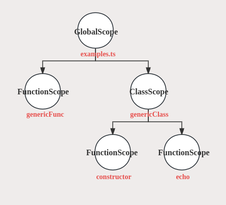
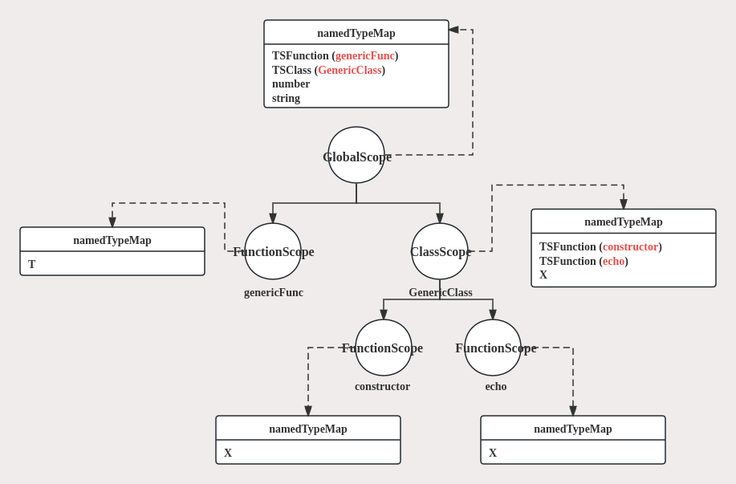
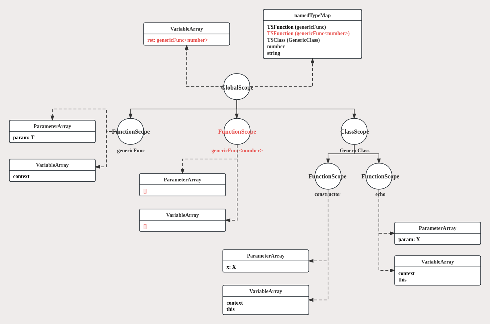
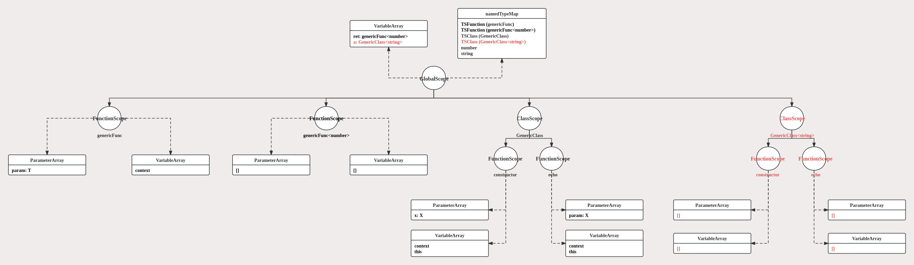
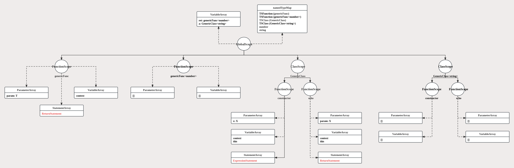
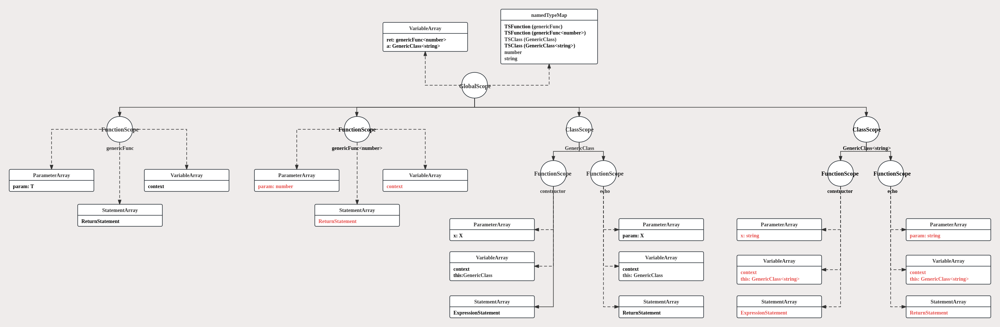

# Generic Type Process

## Generic Types
At present, the processing of generic types mainly focuses on generic functions and generic classes.  

### generic function
```
function genericFunc<T>(param: T): T {
    return param;
}

export function numberFunc() {
    console.log(genericFunc(100));
}
```

### generic class
```
class GenericClass<X> {
    x: X;

    constructor(x: X) {
        this.x = x;
    }
    echo(param: X) {
        return param;
    }
}

const a = new GenericClass('string');
console.log(a.echo('hello world'));
```

## Type Process
This compiler will perform multiple scans during the `syntax` processing stage, the processing of types runs through these scans.  
After the `syntax` processing stage, basic types (such as ***number***, ***string***) will be passed directly to the next processing stage; complex types (such as ***class***, ***function***) will generate `Scope`s (such as ***ClassScope***, ***FunctionScope***) for processing in the `semantic` processing stage.  
The creation of each `Scope` relies on the corresponding ***DeclarationNode*** in AST tree. Take the following case as an example to explain how the compiler processes generic types.

- - -

```
// example.ts
function genericFunc<T>(param: T): T {
    return param;
}

class GenericClass<X> {
    x: X;

    constructor(x: X) {
        this.x = x;
    }
    echo(param: X) {
        return param;
    }
}

const ret = genericFunc(100);
console.log(ret);

const a = new GenericClass('string');
const echoWord = a.echo('hello world');
console.log(echoWord);
```
- - -

### Scope Scan
Starting from the root node of the syntax tree, traverse the entire AST: 
- when a ***SourceFile*** node is scanned, a `GlobalScope` is created
- when a ***ClassDeclaration*** node is scanned, a `ClassScope` is created
- when a ***FunctionDeclaration*** node is scanned, a `FunctionScope` is created

After this scan, the compiler will create a scope tree with `GlobalScope` as the root for each ts source file to organize the file content.  

<div align=center>
	
</div>

- - -

### Type Scan
In this scanning phase, the compiler mainly processes the following nodes in the AST: 
- **VariableDeclarationNode**: create a type based on the initialization expression of the variable
- **Parameter**: create a type based on the type information of the parameter
- **ClassDeclarationNode**: create a `TSClass` type
- **InterfaceDeclarationNode**: create a `TSInterface` type
- **FunctionDeclarationNode**: create a `TSFunction` type
  
After creating a new type, the type information will be stored in parent scope's ***namedTypeMap***.  

<div align=center>
	
</div>

- - -

### Variable scan
In the variable scan phase, the compiler will analyze and process the ***VariableDeclarationNode*** and ***Parameter*** starting from the root of the AST. At this time, the specialization of generic types may be performed.   

- - -

#### Specialization of Generic Function
When processing the global variable `const ret = genericFunc(100);`, the specialization of the generic function will be performed.

```
The time for specializing a generic function is when the function is called.
```

Specialization of generic functions mainly performs the following two operations:
- generate a new `TSFunction` type based on the type arguments and the generic `TSFunction` type
- generate a new `FunctionScope` based on the type arguments and the generic `FunctionScope`  

<div align=center>
	
</div>

The parameters and local variables in the new `FunctionScope` will not be processed at this time. We will process them uniformly when processing statements.  

- - -

#### Specialization of Generic Class
When processing the global variable `const a = new GenericClass('string');`, the specialization of the generic class will be performed.

```
The time for specializing a generic class is when creating an class instance.
```

Specialization of generic classes mainly performs the following two operations:
- generate a new `TSClass` type based on the type arguments and the generic `TSClass` type
- generate a new `ClassScope` based on the type arguments and the generic `ClassScope`  

<div align=center>
	
</div>

- - -

### Statement Scan
In this scanning phase, the compiler generates the statements in `FunctionScope` based on the content of **FunctionDeclarationNode**.

<div align=center>
	
</div>

- - -

Since the specialized function does not have a corresponding **FunctionDeclarationNode** on the AST tree, the generation of its statements relies on the generic `FunctionScope`:
- generate a specialized **ParameterArray** based on **ParameterArray** and type arguments of generic `FunctionScope`
- generate a specialized **VariableArray**(such as ***context***, ***this***) based on **VariableArray** and type arguments of generic `FunctionScope`
- generate new statements based on the **StatementArray** and type arguments of the generic `FunctionScope`. When processing a VariableStatement, after specializing this statement, add the local variable represented by the statement to **VariableArray**.

<div align=center>
	
</div>

- - -

### specialized type generation
After these scanning phases, the specialization of a generic type is completed.