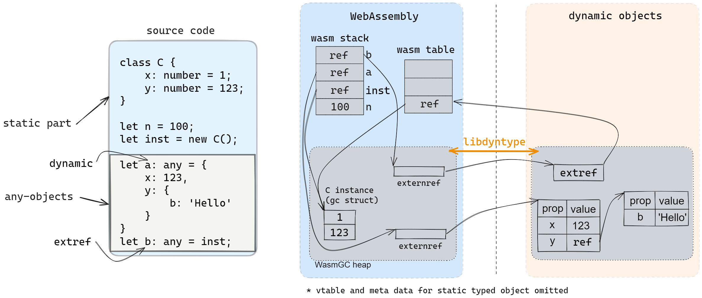
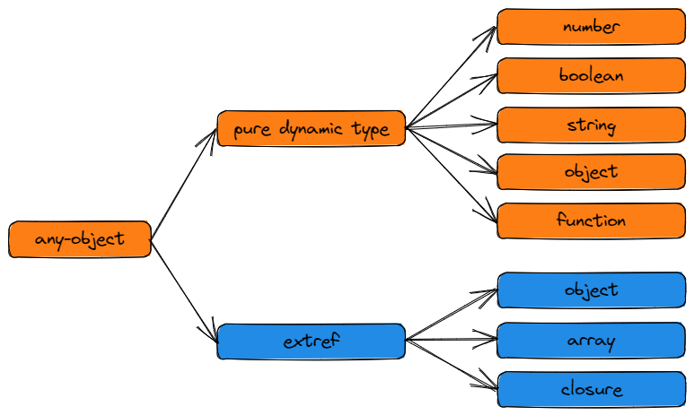

# libdyntype API spec

## Overview

`libdyntype` is a library for supporting dynamic objects for WebAssembly. It provides APIs for creating, accessing and manipulating dynamic objects. The dynamic objects are represented as `externref` in WebAssembly, the actual memory space is created and managed by external environment.

The dynamic objects managed by `libdyntype` are called `any-object`, it can be divided into two categories:
1. `pure dynamic type`: these objects are originally created from libdyntype.
2. `extref`: these objects are created when some static objects are assigned to an `any-object`. It's still a dynamic object, but it has some special properties to store references to the static object.

For `extref`, there are two levels for the implementation:
- level-1:
    - Support creating `extref` when assigning static object to any-object, but can't access the static fields through libdyntype APIs, the `extref` must be cast back to static type before accessing.

        > level-1 is not bound to a specific source language to be compiled to WebAssembly, libdyntype developer don't need to learn details of the language design and wasm runtime APIs.
- level-2 (**mixed-type**):
    - Based on level 1, additional support for accessing static fields through libdyntype APIs. Also support add new dynamic properties to the `extref`.

        > level-2 is bound to a specific source language as well as the target wasm runtime, libdyntype developer must know:
            - the object layout of the specific languages
            - the wasm runtime APIs for accessing the fields of these static objects, or APIs for invoking wasm functions

## Dependent status

These APIs are required by `dynamic types`, the absence of this set of APIs would prevent apps utilizing dynamic types from functioning correctly.

> Note: some standard libraries may depends on libdyntype, e.g. `console.log`, so it is likely most apps will not work if libdyntype is not provided.

## Concepts

- **dyntype context**

    An opaque pointer provided by the libdyntype implementer, this pointer will be stored in application once startup, and passed to all APIs as the first argument. If the libdyntype implementation doesn't need a context, it can be `NULL`.

- **extref**

    In `ts2wasm-compiler` there are both static and dynamic types, if a statically-typed variable is assigned to an any-typed one, then the dynamic object actually hold a reference to the static world, this kind of object is called `extref`.
    > Note that the world `extref` here is different from the `externref` in WebAssembly, it is viewed from the libdyntype's perspective.

    The extref must record two things:
    1. A tag to indicate whether the static object is an `object`, `array` or `closure`
    2. A reference to the static object, the reference is a table element index inside wasm table

    The actual representation of `extref` is implementer-defined, it doesn't need to be a new type. A possible representation is a normal `object` with specific fields to store the tag and reference to static object.

- **thread-safety**

    `libdyntype` assumes applications are executed in a single thread environment, no thread safety is guaranteed.

- **WasmGC string**

    string represented by WasmGC array + WasmGC struct, the struct contains two fields:
    1. `flag: i32`: a reserved field for encoding and other future use
    2. `data: array<i8>`: the array to store string content

## Module name
`libdyntype`

## APIs

- **dyntype_get_context**
    - **Description**
        - Get the dyntype context
    - **Parameters**
        - None
    - **Return**
        - `externref`: the dyntype context

- **dyntype_new_number**
    - **Description**
        - Create a dynamic typed number
    - **Parameters**
        - `externref`: the dyntype context
        - `f64`: the number value
    - **Return**
        - `externref`: the created number

- **dyntype_new_boolean**
    - **Description**
        - Create a dynamic typed boolean
    - **Parameters**
        - `externref`: the dyntype context
        - `i32`: the boolean value
    - **Return**
        - `externref`: the created boolean

- **dyntype_new_string**
    - **Description**
        - Create a dynamic typed string
    - **Parameters**
        - `externref`: the dyntype context
        - `structref`: the wasm represented string
    - **Return**
        - `externref`: the created string

- **dyntype_new_undefined**
    - **Description**
        - Create a dynamic typed undefined
    - **Parameters**
        - `externref`: the dyntype context
    - **Return**
        - `externref`: the created undefined

- **dyntype_new_null**
    - **Description**
        - Create a dynamic typed null
    - **Parameters**
        - `externref`: the dyntype context
    - **Return**
        - `externref`: the created null

- **dyntype_new_object**
    - **Description**
        - Create a dynamic typed object
    - **Parameters**
        - `externref`: the dyntype context
    - **Return**
        - `externref`: the created object

- **dyntype_new_object_with_proto**
    - **Description**
        - Create a dynamic typed object with prototype
    - **Parameters**
        - `externref`: the dyntype context
        - `externref`: the prototype of the object
    - **Return**
        - `externref`: the created object

- **dyntype_new_object_with_class**
    - **Description**
        - Create a dynamic typed object with class
    - **Parameters**
        - `externref`: the dyntype context
        - `i32`: the class name (string)
        - `arrayref`: rest parameters array
    - **Return**
        - `externref`: the created object

- **dyntype_new_array**
    - **Description**
        - Create a dynamic typed array with length
    - **Parameters**
        - `externref`: the dyntype context
        - `i32`: the length of the array
    - **Return**
        - `externref`: the created array

- **dyntype_new_extref**
    - **Description**
        - Create a dynamic typed extref
    - **Parameters**
        - `externref`: the dyntype context
        - `i32`: the tag to indicate the static object is `object`|`array`|`closure`
        - `i32`: the reference to the static object (wasm table element index)
    - **Return**
        - `externref`: the created extref

- **dyntype_set_elem**
    - **Description**
        - if it's a dynamic typed array:
            - Set an element to the dynamic typed array
        - if it's an extref:
            - Level 1: raise exception: `libdyntype: unsupport operation for extref: set_elem`
            - Level 2: set an element to the boxed static typed array
    - **Parameters**
        - `externref`: the dyntype context
        - `externref`: the array
        - `i32`: the index of the element to be set
        - `externref`: the element to be set
    - **Return**
        - None

- **dyntype_get_elem**
    - **Description**
        - if it's a dynamic typed array:
            - Get an element from the dynamic typed array
        - if it's an extref:
            - Level 1: raise exception: `libdyntype: unsupport operation for extref: get_elem`
            - Level 2: get an element to the boxed static typed array
    - **Parameters**
        - `externref`: the dyntype context
        - `externref`: the array
        - `i32`: the index of the element to be get
    - **Return**
        - `externref`: the element

- **dyntype_set_property**
    - **Description**
        - if it's a dynamic typed object:
            - Set the property of the dynamic typed object
        - if it's an extref:
            - Level 1: raise exception: `libdyntype: unsupport operation for extref: set_property`
            - Level 2: set the field value of the boxed static typed object if the field exists in the static object, otherwise add a dynamic property
    - **Parameters**
        - `externref`: the dyntype context
        - `externref`: the object
        - `i32`: the property name (string)
        - `externref`: the property value
    - **Return**
        - `i32`: result, 0 for success, -1 otherwise

- **dyntype_get_property**
    - **Description**
        - if it's a dynamic typed object:
            - Get the property of the dynamic typed object
        - if it's an extref:
            - Level 1: raise exception: `libdyntype: unsupport operation for extref: get_property`
            - Level 2: get the field value of the boxed static typed object if the field exists in the static object, otherwise return `undefined`
    - **Parameters**
        - `externref`: the dyntype context
        - `externref`: the object
        - `i32`: the property name (string)
    - **Return**
        - `externref`: the property value

- **dyntype_get_own_property**
    - **Description**
        - if it's a dynamic typed object:
            - Get the own property of the dynamic typed object
        - if it's an extref:
            - Level 1: raise exception: `libdyntype: unsupport operation for extref: get_own_property`
            - Level 2: get the field value of the boxed static typed object if the field exists in the static object, otherwise return `undefined`
    - **Parameters**
        - `externref`: the dyntype context
        - `externref`: the object
        - `i32`: the property name (string)
    - **Return**
        - `externref`: the property value

- **dyntype_define_property**
    - **Description**
        - if it's a dynamic typed object:
            - Define the property of the dynamic typed object
        - if it's an extref:
            - raise exception: `libdyntype: unsupport operation for extref: define_property`
    - **Parameters**
        - `externref`: the dyntype context
        - `externref`: the object
        - `i32`: the property name (string)
        - `externref`: the property descriptor
    - **Return**
        - `i32`: result, 0 for success, -1 otherwise

- **dyntype_has_property**
    - **Description**
        - if it's a dynamic typed object:
            - Check if the dynamic typed object has the property
        - if it's an extref:
            - Level 1: raise exception: `libdyntype: unsupport operation for extref: has_property`
            - Level 2: check if the field exists in the static typed object
    - **Parameters**
        - `externref`: the dyntype context
        - `externref`: the object
        - `i32`: the property name (string)
    - **Return**
        - `i32`: result, 1 if property exists, 0 otherwise

- **dyntype_delete_property**
    - **Description**
        - if it's a dynamic typed object:
            - Delete the property of the dynamic typed object
        - if it's an extref:
            - Level 1: raise exception: `libdyntype: unsupport operation for extref: delete_property`
            - Level 2: if the field exists in the boxed static object, raise exception: `libdyntype: delete property on static type object`, otherwise delete the dynamic property of the mixed type
    - **Parameters**
        - `externref`: the dyntype context
        - `externref`: the object
        - `i32`: the property name (string)
    - **Return**
        - `i32`: result, 0 for success, -1 otherwise

- **dyntype_is_number**
    - **Description**
        - Check if the dynamic typed value is a number
    - **Parameters**
        - `externref`: the dyntype context
        - `externref`: the value
    - **Return**
        - `i32`: result, 1 if it is a number, 0 otherwise

- **dyntype_is_bool**
    - **Description**
        - Check if the dynamic typed value is a boolean
    - **Parameters**
        - `externref`: the dyntype context
        - `externref`: the value
    - **Return**
        - `i32`: result, 1 if it is a boolean, 0 otherwise

- **dyntype_is_string**
    - **Description**
        - Check if the dynamic typed value is a string
    - **Parameters**
        - `externref`: the dyntype context
        - `externref`: the value
    - **Return**
        - `i32`: result, 1 if it is a string, 0 otherwise

- **dyntype_is_undefined**
    - **Description**
        - Check if the dynamic typed value is an undefined
    - **Parameters**
        - `externref`: the dyntype context
        - `externref`: the value
    - **Return**
        - `i32`: result, 1 if it is an undefined, 0 otherwise

- **dyntype_is_null**
    - **Description**
        - Check if the dynamic typed value is a null
    - **Parameters**
        - `externref`: the dyntype context
        - `externref`: the value
    - **Return**
        - `i32`: result, 1 if it is a null, 0 otherwise

- **dyntype_is_object**
    - **Description**
        - Check if the dynamic typed value is an object
    - **Parameters**
        - `externref`: the dyntype context
        - `externref`: the value
    - **Return**
        - `i32`: result, 1 if it is an object, 0 otherwise

- **dyntype_is_array**
    - **Description**
        - Check if the dynamic typed value is an array
    - **Parameters**
        - `externref`: the dyntype context
        - `externref`: the value
    - **Return**
        - `i32`: result, 1 if it is an array, 0 otherwise

- **dyntype_is_function**
    - **Description**
        - Check if the dynamic typed value is a function
    - **Parameters**
        - `externref`: the dyntype context
        - `externref`: the value
    - **Return**
        - `i32`: result, 1 if it is a function, 0 otherwise

- **dyntype_is_extref**
    - **Description**
        - Check if the dynamic typed value is an extref
    - **Parameters**
        - `externref`: the dyntype context
        - `externref`: the value
    - **Return**
        - `i32`: result, 1 if it is an extref, 0 otherwise

- **dyntype_to_number**
    - **Description**
        - Convert the dynamic typed value to a static number
    - **Parameters**
        - `externref`: the dyntype context
        - `externref`: the value
    - **Return**
        - `f64`: the converted number

- **dyntype_to_bool**
    - **Description**
        - Convert the dynamic typed value to a static boolean
    - **Parameters**
        - `externref`: the dyntype context
        - `externref`: the value
    - **Return**
        - `i32`: the converted boolean

- **dyntype_to_string**
    - **Description**
        - Convert the dynamic typed value to a static string
    - **Parameters**
        - `externref`: the dyntype context
        - `externref`: the value
    - **Return**
        - `structref`: the converted string

- **dyntype_to_extref**
    - **Description**
        - Get the static object reference from extref
    - **Parameters**
        - `externref`: the dyntype context
        - `externref`: the extref value
    - **Return**
        - `i32`: the static object reference (wasm table element index)

- **dyntype_is_exception**
    - **Description**
        - Check if the dynamic typed value is an exception
    - **Parameters**
        - `externref`: the dyntype context
        - `externref`: the value
    - **Return**
        - `i32`: result, 1 if it is an exception, 0 otherwise

- **dyntype_is_falsy**
    - **Description**
        - Check if the dynamic typed value is a falsy value
    - **Parameters**
        - `externref`: the dyntype context
        - `externref`: the value
    - **Return**
        - `i32`: 1 if it is a falsy value, 0 otherwise

- **dyntype_typeof**
    - **Description**
        - Get the type of the dynamic typed value
    - **Parameters**
        - `externref`: the dyntype context
        - `externref`: the value
    - **Return**
        - `structref`: the type of the value (WasmGC string)

- **dyntype_type_eq**
    - **Description**
        - Check if the given dynamic typed objects are equal
    - **Parameters**
        - `externref`: the dyntype context
        - `externref`: the lhs value
        - `externref`: the lhs value
    - **Return**
        - `i32`: 1 if the object is equal, 0 otherwise

- **dyntype_toString**
    - **Description**
        - Convert the dynamic typed value to a string
    - **Parameters**
        - `externref`: the dyntype context
        - `externref`: the value
    - **Return**
        - `structref`: the converted string (WasmGC string)

- **dyntype_cmp**
    - **Description**
        - Compare two dynamic typed values
    - **Parameters**
        - `externref`: the dyntype context
        - `externref`: the lhs value
        - `externref`: the rhs value
        - `i32`: operator, 29 for `<`, 31 for `>`, 32 for `<=`, 33 for `>=`, 34 for `==`, 35 for `!=`, 36 for `===`, 37 for `!==
    - **Return**
        - `i32`: the comparison result, 1 for true, 0 otherwise

- **dyntype_set_prototype**
    - **Description**
        - if it's a dynamic typed object:
            - Set the prototype of the dynamic typed object
        - if it's an extref:
            - raise exception: `libdyntype: unsupport operation for extref: set_prototype`
    - **Parameters**
        - `externref`: the dyntype context
        - `externref`: the object
        - `externref`: the prototype
    - **Return**
        - `i32`: result, 0 for success, -1 for failure

- **dyntype_get_prototype**
    - **Description**
        - if it's a dynamic typed object:
            - Get the prototype of the dynamic typed object
        - if it's an extref:
            - raise exception: `libdyntype: unsupport operation for extref: get_prototype`
    - **Parameters**
        - `externref`: the dyntype context
        - `externref`: the object
    - **Return**
        - `externref`: the prototype

- **dyntype_instanceof**
    - **Description**
        - Check if the dynamic typed value is an instance of the given value
    - **Parameters**
        - `externref`: the dyntype context
        - `externref`: the lhs value
        - `externref`: the rhs value
    - **Return**
        - `i32`: 1 if true, 0 otherwise

- **dyntype_invoke**
    - **Description**
        - if it's a dynamic typed object:
            - Invoke method of the given dynamic object if name is not NULL, otherwise invoke the given dynamic object
        - if it's an extref:
            - Level 1: raise exception: `libdyntype: unsupport operation for extref: invoke`
            - Level 2: invoke the boxed wasm function (name is NULL) or class method (name is not NULL)
    - **Parameters**
        - `externref`: the dyntype context
        - `i32`: method name (string)
        - `externref`: the given dynamic object
        - `arrayref`: the arguments array
    - **Return**
        - `externref`: the return value

- **dyntype_get_global**
    - **Description**
        - Get a global dynamic variable
    - **Parameters**
        - `externref`: the dyntype context
        - `i32`: global variable name (string)
    - **Return**
        - `externref`: the global variable
