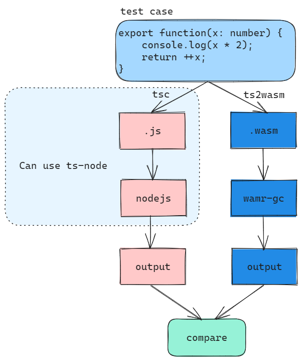

# ts2wasm-compiler validation strategy (WIP)

Ts2wasm-compiler aims to compile TypeScript source code to WebAssembly bytecode while keep the same semantics, the default validation strategy is to compile the same TypeScript source code into both JavaScript (through `tsc`) and WebAssembly (through `ts2wasm-compiler`) and compare the execution results.




## Test case organization

Test cases are organized into three levels:
1. category

    - A category is a collection of test suites serving the same goal (e.g. syntax, stdlib, etc)
    - Most categories used default validation strategy as shown above, some special categories may have special strategy and they can have their own test framework to execute the cases and validate the results

2. suite

    - A suite is a folder containing several sub-folders or files for testing a language feature (e.g. syntax::BinaryenExpression)
    - Only folders directly in the category root dir is a suite, sub-folders inside a suite is not a new suite. Validators can use up to **two level** of sub-folders according to the complex of the tested feature, but it's recommended to keep a light folder structure
    - Suite should be automatically detected by the test framework of the corresponding category

3. case

    - A `standalone` case is an `exported function` inside a source file, it should return something or print something as the result
    - `multi-file` cases are stored in an folder containing an `index.ts` as the entry file, it can import any other files inside the `folder` or any level of `sub-folders`
    - It's allowed to write several cases inside a single file, but the cases with side effects must be put into one file to avoid influence on other files

## Test case composition

``` TypeScript
/// compile options: xxx
/// auto_parameter: none | single | matrix

export binaryExpressionAdd(x: number, y: number) {
    return x + y;
}

export binaryExpressionSub(x: number, y: number) {
    return x - y;
}
```

1. Each file can optionally have `front matter` to interact with the `test framework`
    - There may be multiple lines in the front matter, each line starts with `///` token
    - A file is the minimal compilation unit, so the front matter apply to all the cases in a file
    - There are some builtin configs which will be automatically consumed by all test frameworks (such as `compile options`, `auto_parameter`), other configs are defined and consumed by the test framework of each categories

    > Note: per-case configuration may be supported in the future if required.

2. Parameters must be `number` or `boolean`, we may support `string` and other type later
    - The test framework may randomly generate a group or several groups of parameters as input

3. The test case body can use any supported syntax, but the return type (if has) should be `number` or `boolean`, otherwise the test framework won't be able to validate the result
    > If you need to validate complex objects content, use `console.log` rather than `return`

4. A separate json file (with same filename) can be placed besides to the case file to record fixed parameters
    - Test framework should always execute based on the fixed parameters (if exists) firstly. (**This ensure the determinacy**)
    - If `auto_parameter` is not none, then test framework automatically generate some parameters as input, and record the parameters in the log if failed. (**This helps to discover more corner cases**)

    ``` json
    [
        {
            "case": "xxxx",
            "args": [
                {
                    "x": 1,
                    "y": 2
                },
                {
                    "x": 100,
                    "y": 1000
                }
            ]
        }
    ]
    ```

## Reference folder structure

``` Bash
tests/
    |--syntax/
        |--binary-expression/
            |--add.ts
            |--add.json
            |--sub.ts
            |--assign.ts
        |--property-access-expression/
        |--call-expression/
        |--if-statement/
        |--loop-statement/
        |--...
    |--stdlib/
        |--array/
        |--string/
    |--fallthrough
        |--map/
        |--JSON/
```
